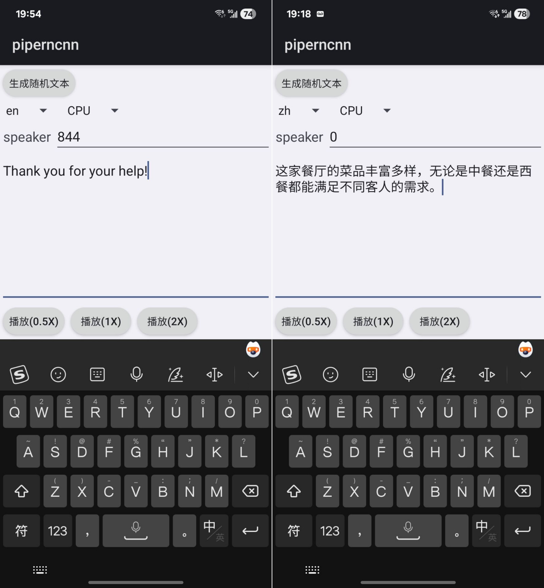

# ncnn-android-piper


piper - fast and local neural text-to-speech engine

This is a sample ncnn android project, it depends on ncnn library

https://github.com/Tencent/ncnn

## android apk file download
https://github.com/nihui/ncnn-android-piper/releases/latest

## how to build and run
### step1
https://github.com/Tencent/ncnn/releases

* Download ncnn-YYYYMMDD-android-vulkan.zip or build ncnn for android yourself
* Extract ncnn-YYYYMMDD-android-vulkan.zip into **app/src/main/jni** and change the **ncnn_DIR** path to yours in **app/src/main/jni/CMakeLists.txt**

### step2
* Open this project with Android Studio, build it and enjoy!

## screenshot


## guidelines for converting piper models

### convert piper checkpoints to ncnn models
1. checkout https://github.com/OHF-Voice/piper1-gpl (113931937cf235fc881afd1ca4be209bc6919bc7)
2. apply patch `piper1-gpl.patch`
3. setup piper with
```shell
python3 -m venv .venv
source .venv/bin/activate
python3 -m pip install -e .[train]
```
4. download piper checkpoint file (*.ckpt) from https://huggingface.co/datasets/rhasspy/piper-checkpoints
5. install pnnx via `pip install -U pnnx`
6. obtain `export_ncnn.py` script
```shell
python export_ncnn.py en.ckpt
```

### convert word list to simple phonemizer dict
1. prepare word list from https://github.com/Alexir/CMUdict
2. for each word, get phonemes via command `./espeak-ng -q -v en-us --ipa word`
3. obtain `config.json` file from https://huggingface.co/datasets/rhasspy/piper-checkpoints
4. replace phonemes with ids according to `phoneme_id_map` in `config.json`
5. write dict binary
```word1 \0x00 ids1 \0xff word2 \0x00 ids2 \0xff .....```
